# Lab 1.01 - Basic API Proxy Development, Deployment and Testing

## Introduction

This is the first lab of the Apigee Developer Training. The main objectives of this lab are:

* Learn how to import an OpenAPI specification into your organization.
* Learn how to create a pass-through API proxy from an existing API specification and deploy it to an environment in your organization.
* Start using the Edge Trace tool to debug your API proxy.
* Become familiar with the Edge out-of-the-box policies.
* Learn how to protect your API using API key.
* Learn how to use a REST client (Postman, curl, httpie) to test your API.

## Create and Deploy a Pass-through Proxy from an OpenAPI Spec

1. Log in to Apigee Edge Enterprise [https://login.apigee.com/login](https://login.apigee.com/login) using your email and password.

    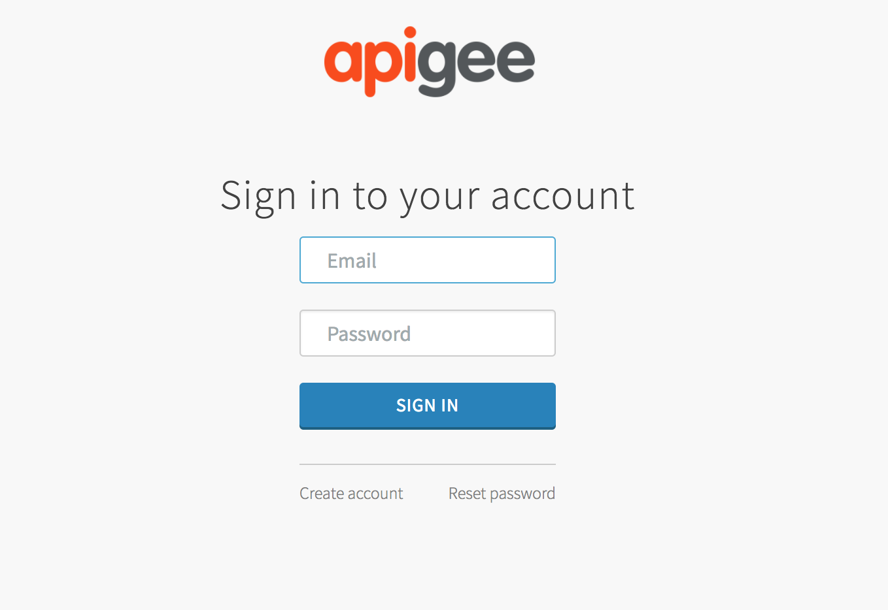

2. Once you are successfully logged in, click **Develop > Specs** on the left menu and import the Book API (v1) OpenAPI specification available in the spec folder. NOTE: Click on the Raw button to see the actual URL that you can use to import the file.

    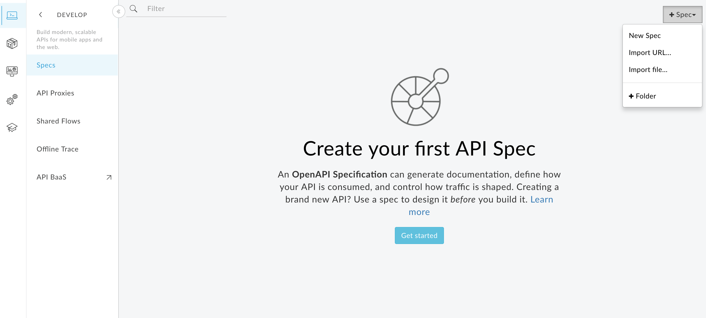

3. Once the API spec has been imported, we will go an create a pass-through API proxy from it. Click **Develop > API Proxies** on the left menu and press the **+ Proxy** button to create a new API Proxy.

    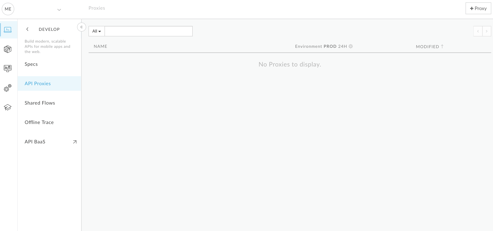

4. Make sure that the option **Reverse Proxy** is checked on the **Type** screen. Click on **Use OpenAPI**, select the API spec that we just imported in the previous step and continue to the next screen.

    

5. Enter the proxy details (name, base path, target URL and description) on the **Details** screen. The url is https://apigee-dev-training.appspot.com/library/v1. Once you are ready jump to the next screen.

    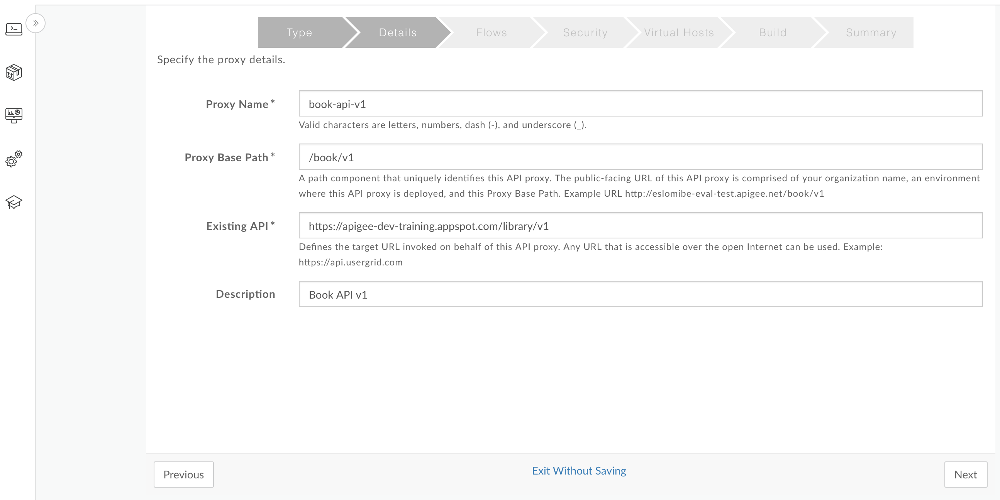

6. On the **Flows** section select for which of the paths available in the OpenAPI specification you would like to create a conditional flow and continue.

    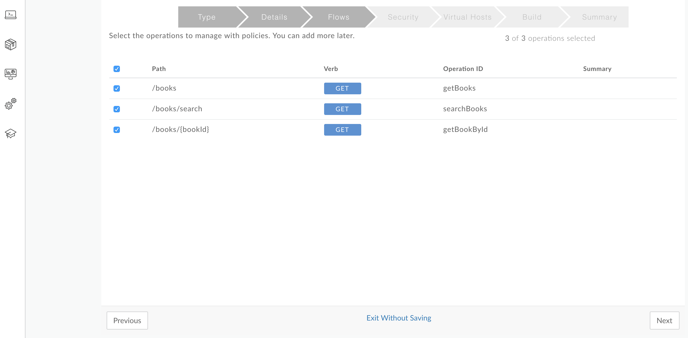

7. We don't have any API security requirements yet, check **Pass through (none)** on the **Security** screen and continue.

    

8. We only want our API to be accessible via HTTPS, so untick default on the **Virtual Hosts** screen and continue. 

    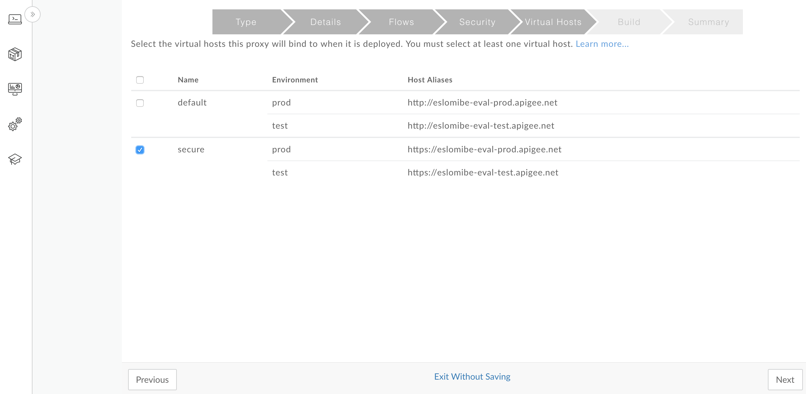

9. Select the environment to which the proxy will be deployed, **test** in our case, on the **Build** screen, click on **Build and Deploy** and wait until the deployment is complete.

    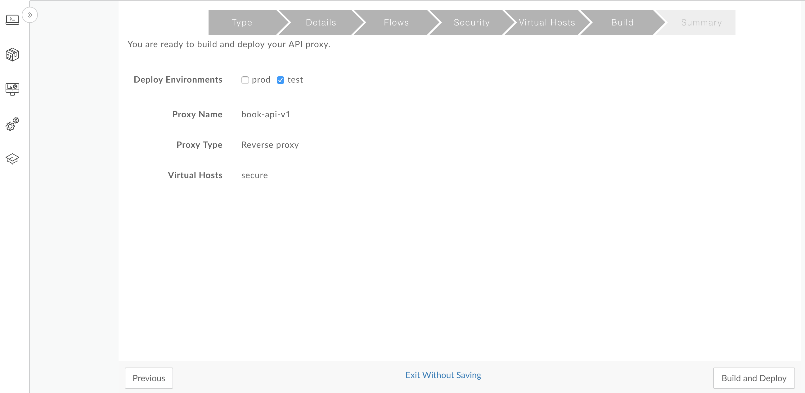

10. Click on **View book-api-v1 proxy in the editor**.

    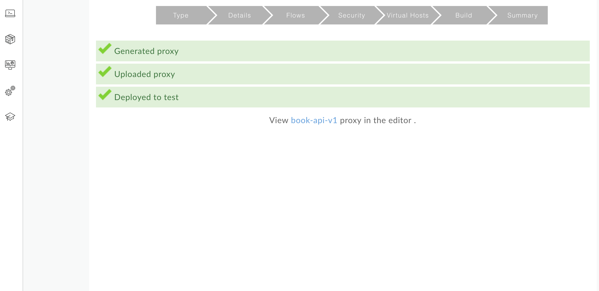

11. Make sure that the proxy is correctly deployed in the selected environment. 

    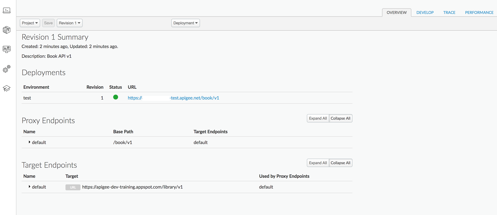

11. Then click on the **TRACE** tab. Once there, verify that the URL in the address bar is https://&lt;APIGEE-ORGANIZATION&gt;-test.apigee.net/book/v1/books and click on the **Send** button. Check the request that was sent to the target and the response received. 

    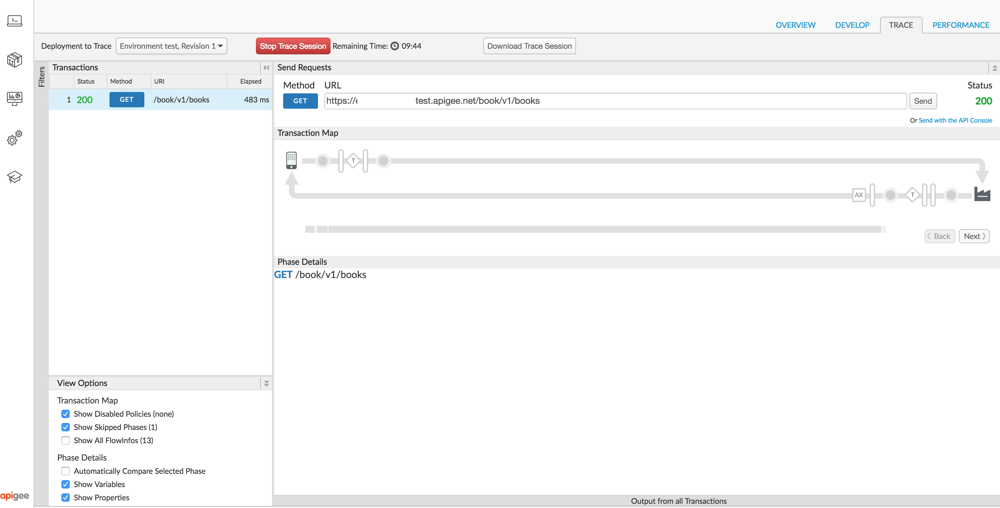

12. Finally change to the **DEVELOP** tab, where we will be doing all the implementation of our API proxy.

    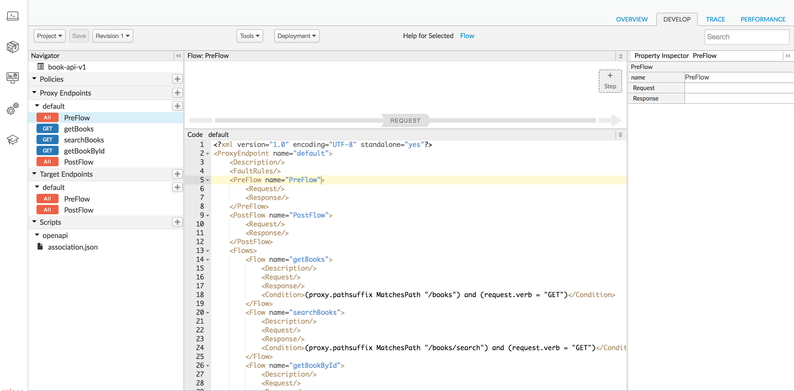

## Mediation: XML to JSON

The target server is returning an XML payload. We would like the clients of our API
to get the clean JSON payload defined in the OpenAPI specification. In order to achieve this, we will be using an [XMLToJSON](https://docs.apigee.com/api-services/reference/xml-json-policy) policy and a [Javascript](https://docs.apigee.com/api-services/reference/javascript-policy) policy. Follow the steps below:

1. Change to the **DEVELOP** tab. On the left side of the screen, click on the **+** button available to the right of **Policies** to add a new XMLToJSON policy. 

    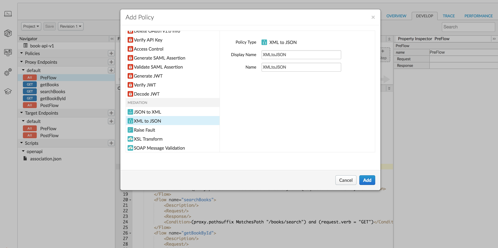

2. Make sure that the XMLToJSON policy is configured as follows in the XML code editor:

        <?xml version="1.0" encoding="UTF-8" standalone="yes"?>
        <XMLToJSON async="false" continueOnError="false" enabled="true" name="XMLToJSON">
            <Options>
                <RecognizeNumbers>false</RecognizeNumbers>
            </Options>
            <OutputVariable>response</OutputVariable>
            <Source>response</Source>
        </XMLToJSON>

3. On the right side of the screen click on **PreFlow** inside the target endpoint called **default**. 

    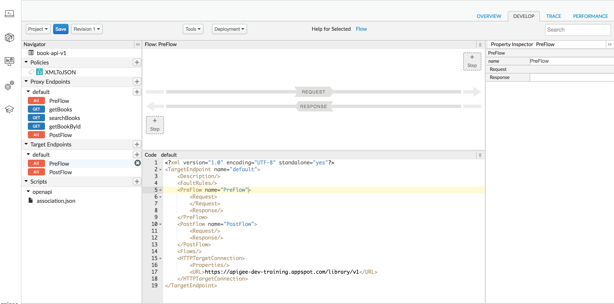

4. Then, select the XMLToJSON policy and drag it so it appears as a new step in response of the flow selected in the previous step

    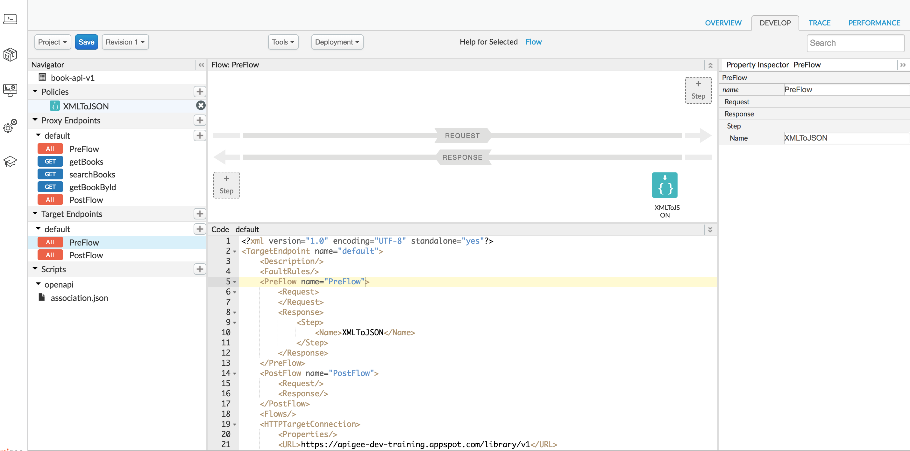

5. Change to the **TRACE** tab, start a new trace session and send a new request to https://&lt;APIGEE-ORGANIZATION&gt;-test.apigee.net/book/v1/books. On the **Transaction Map** click on the icon of the XMLToJSON policy so you can inspect what the response content it once the XML to JSON transformation has been performed.

    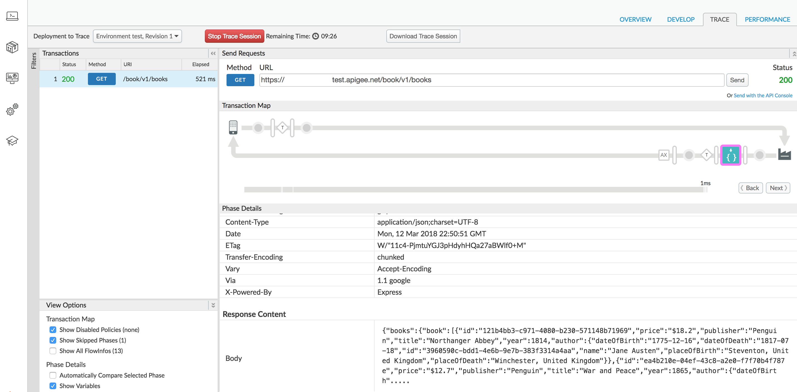

6. The XML payload received from the target server is converted into JSON, but it is not in the exact format specified by our API specification yet. We will use a Javascript policy to perform the required adjustments.

    

7. Find below the contents of the Javascript resource file transformJSON.js. You only need to click transformJSON.js under ***Scripts* on the right hand side to update the contents of script.

        var pathsuffix = context.getVariable('proxy.pathsuffix');
        var payload = JSON.parse(context.getVariable('response.content'));
        if(new RegExp('^/books(/search)*$').test(pathsuffix)) {
            print(Array.isArray(payload.books.book));
            if(Array.isArray(payload.books.book)) {
                payload = payload.books.book;        
            } else {
                payload = [ payload.books.book ];
            }    
        } else if(new RegExp('^/books/[0-9a-f]{8}-[0-9a-f]{4}-[0-9a-f]{4}-[0-9a-f]{4}-[0-9a-f]{12}$').test(pathsuffix)) {
            payload = payload.book;
        } else {
            payload = '';
        }
        context.setVariable('response.content', JSON.stringify(payload));     

    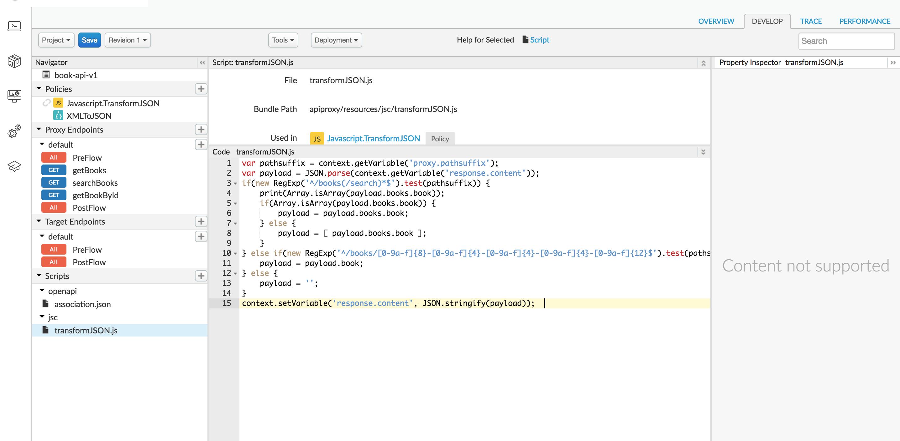

4. Finally, add the Javascript policy to the &lt;Response&gt; element of the PreFlow in the TargetEndpoint, just after the XMLToJSON policy.  

    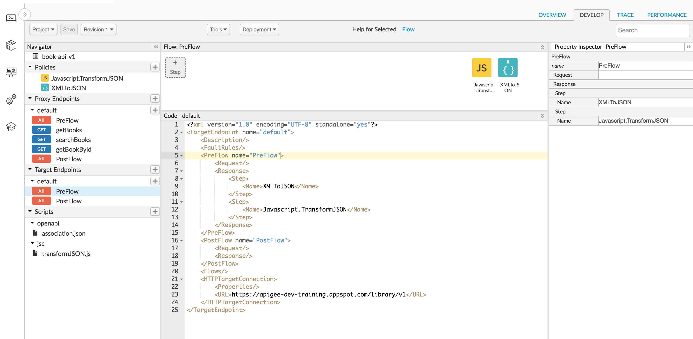

## Caching

To improve the performance of our API we are going to introduce response caching and use the [ResponseCache]((https://docs.apigee.com/api-services/reference/response-cache-policy) policy for that purpose.

1. Click **Admin > Environments** on the left menu and make sure that you are have the **Caches** tab selected. Click **Edit** on the right side, then click **+ Cache**, enter the name (book-api-v1-response-cache) and save.

    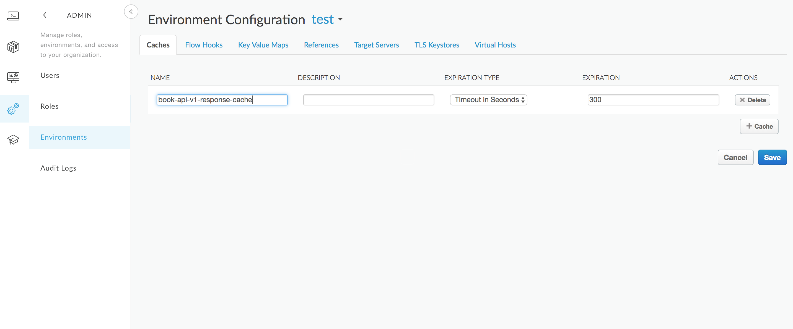

2. Add a ResponseCache policy. As cache key we are going to use the value of the **message.uri** runtime variable. The message.uri variable contains the complete URI path including the querystring parameters. See below how the XML of the policy should look like:

    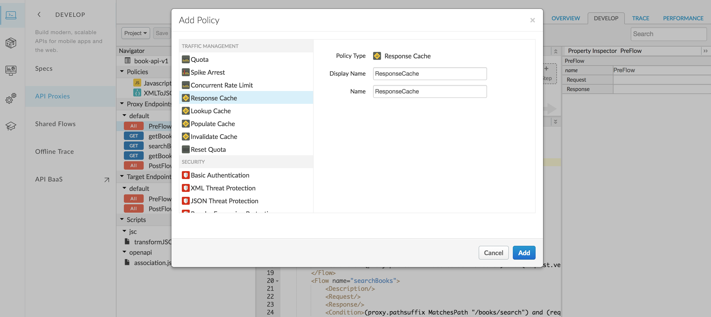

        <?xml version="1.0" encoding="UTF-8" standalone="yes"?>
        <ResponseCache async="false" continueOnError="false" enabled="true" name="ResponseCache">
            <CacheKey>
                <KeyFragment ref="message.uri" />
            </CacheKey>
            <CacheResource>book-api-v1-response-cache</CacheResource>
            <ExpirySettings>
                <TimeoutInSec>600</TimeoutInSec>
            </ExpirySettings>
        </ResponseCache>

2. The ResponseCache policy has to be always added in the request and the response flows to work properly. Drag the policy and add it to the &lt;Request&gt; element of the PreFlow in the ProxyEndpoint and to the &lt;Response&gt; element of the PreFlow in the TargetEndpoint. We want to cache the response once it has been transformed from XML to JSON, so we will add it just after Javascript policy.

    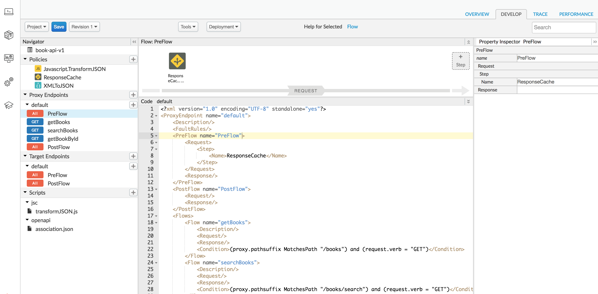

    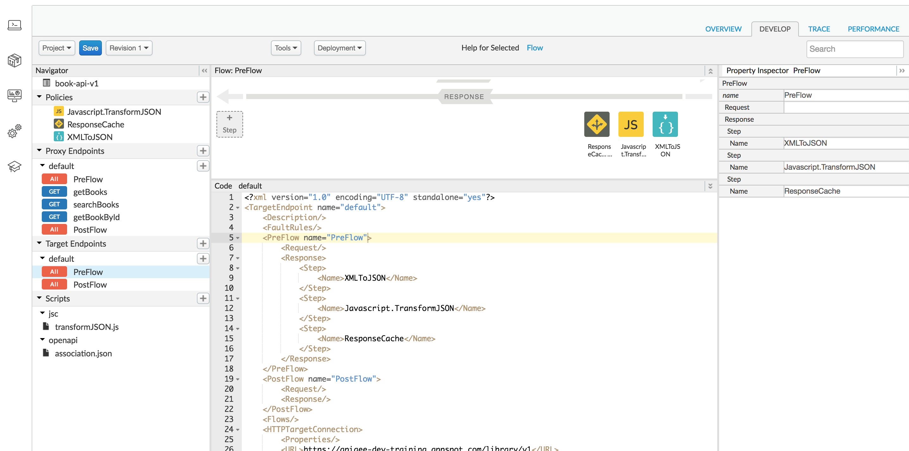

Check if the ResponseCache policy is working using the Trace tool. There you will be able to determine wether the cache was hit or not, whenever you make a new request. You might want to check what happens when the cache is cleared too. In order to clear it, go back the Caches tab **Admin > Environments** and click on the **Clear** button available to the left of the row where your cache is listed.

## Set up an Environment Key-value Map for API proxy configuration

It is a good practice to always have an environment key-value map per API proxy containing configurable parameters that might need to be changed at runtime. We are going to create a key-value map named book-api-v1-configuration and have the expiry time settings of the cached entries in the response cache as a configurable parameter. Please, follow the steps below to create the map:

1. On the **Key Value Maps** tab of the **Admin > Environments** section, click **Edit**.

2. Click on the **+Key Value Map** button. Enter the name of the key-value map (book-api-v1-configuration). We will use a non-encrypted one for this proxy, since we are not storing any sensitive information.

    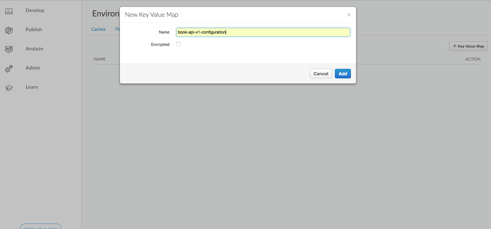

3. Add a new entry named cacheEntryExpiry and set it to a value of 3600. 

    

Once the key-value map is created and populated with the entries, we need to add the KeyValueMapOperations policy that will read the values of the entries to the API proxy: 

1. Go back to the **DEVELOP** tab and create a new KeyValueMapOperations policy with the configuration provided below:

    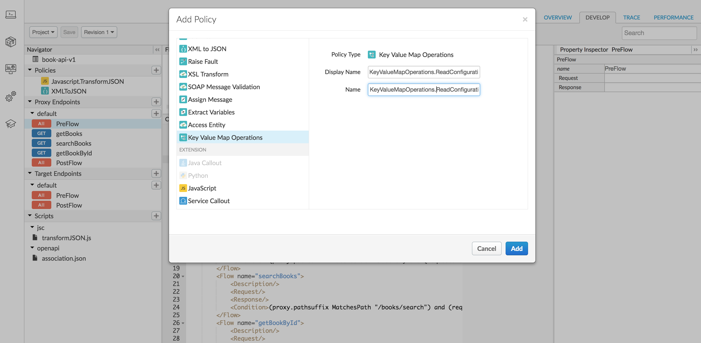

        <?xml version="1.0" encoding="UTF-8" standalone="yes"?>
        <KeyValueMapOperations async="false" continueOnError="false" enabled="true" name="KeyValueMapOperations.ReadConfiguration" mapIdentifier="book-api-v1-configuration">
            <Scope>environment</Scope>
            <ExpiryTimeInSecs>300</ExpiryTimeInSecs>
            <Get assignTo="config.cacheEntryExpiry">
                <Key>
                    <Parameter>cacheEntryExpiry</Parameter>
                </Key>
            </Get>
        </KeyValueMapOperations>

2. Drag the policy that you just created and add it as first step to the &lt;Request&gt; element of the PreFlow in the ProxyEndpoint. 

    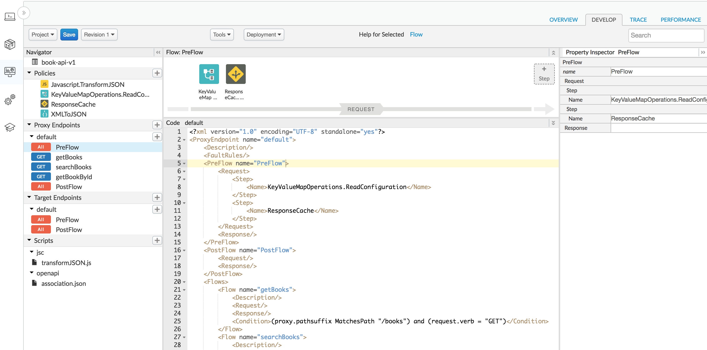

3. Edit the ResponseCache policy so the configuration.cacheEntryExpiry variable is used in the cache entry expiry settings:

        <?xml version="1.0" encoding="UTF-8" standalone="yes"?>
        <ResponseCache async="false" continueOnError="false" enabled="true" name="ResponseCache">
            <CacheKey>
                <KeyFragment ref="message.uri" />
            </CacheKey>
            <CacheResource>book-api-v1-response-cache</CacheResource>
            <ExpirySettings>
                <TimeoutInSec ref="config.cacheKeyExpiry">600</TimeoutInSec>
            </ExpirySettings>
        </ResponseCache>

Check that everything is still working properly. 

## Basic API Security using and API Key.

Finally, we are going to protect our API usign an API key. The API key will have to be provided using a querystring parameter named apikey.

The first thing to do is to click on **Publish** on the left menu and follow the steps below:

1. Create an API product named BookAPIProduct that includes the book-api-v1 proxy and is available in the test environment.

    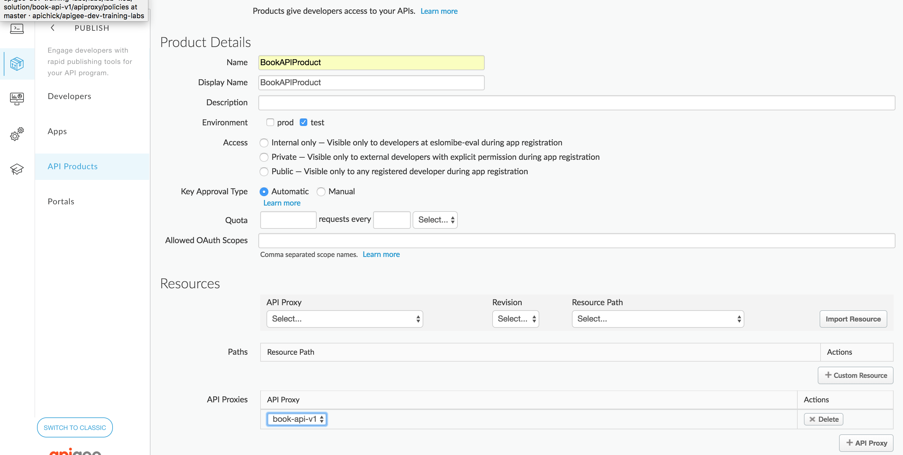

2. Create a new Developer.

    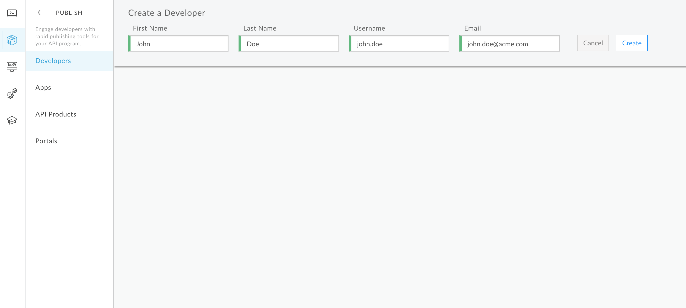

3. Create a Developer app for the developer created in the previous step, assign the BookAPIProduct to it and the click on the **Save** button. Go back inside the API product and you will see that a set of client credentials have been created. The consumer key is the value that you will have to set the apikey querystring parameter to.

    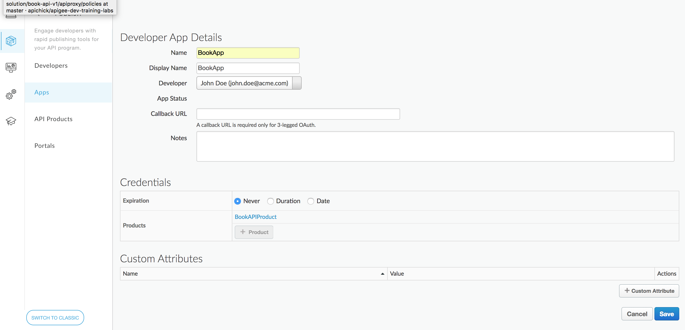

Once all this is done, we need to add a [VerifyAPIKey](https://docs.apigee.com/api-services/reference/verify-api-key-policy) policy to the API proxy: 

1. Go back to the **DEVELOP** tab and create a new VerifyAPI key policy as shown below:

    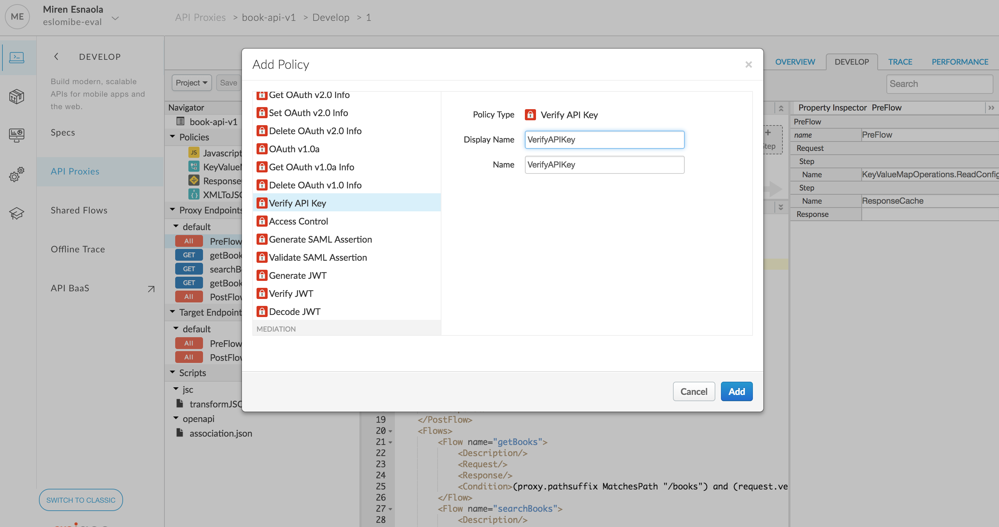

        <?xml version="1.0" encoding="UTF-8" standalone="yes"?>
        <VerifyAPIKey async="false" continueOnError="false" enabled="true" name="VerifyAPIKey">
            <APIKey ref="request.queryparam.apikey"/>
        </VerifyAPIKey>

2. Add it as a first step to the &lt;Request&gt; element of the proxy PreFlow in the ProxyEndpoint.

    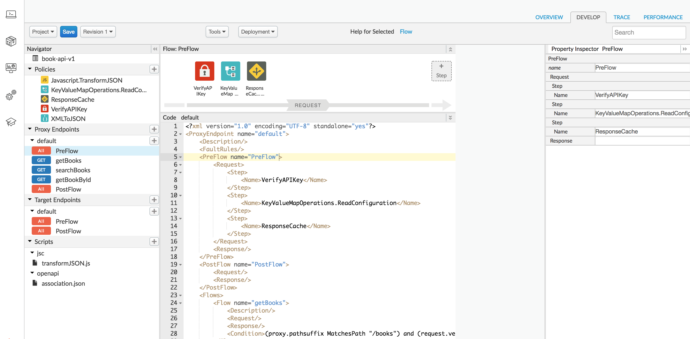

Use the Trace tool to see if everything works fine when submitting requests with a valid consumer key as apikey querystring parameter. Check what happens when no key or an invalid key is used.
