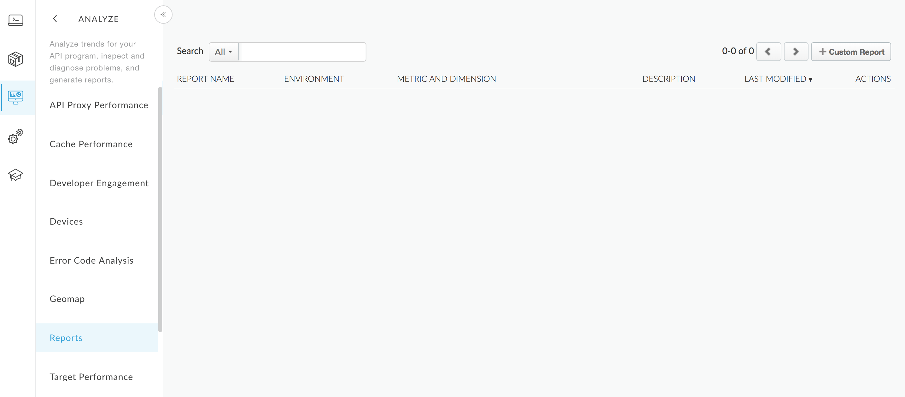
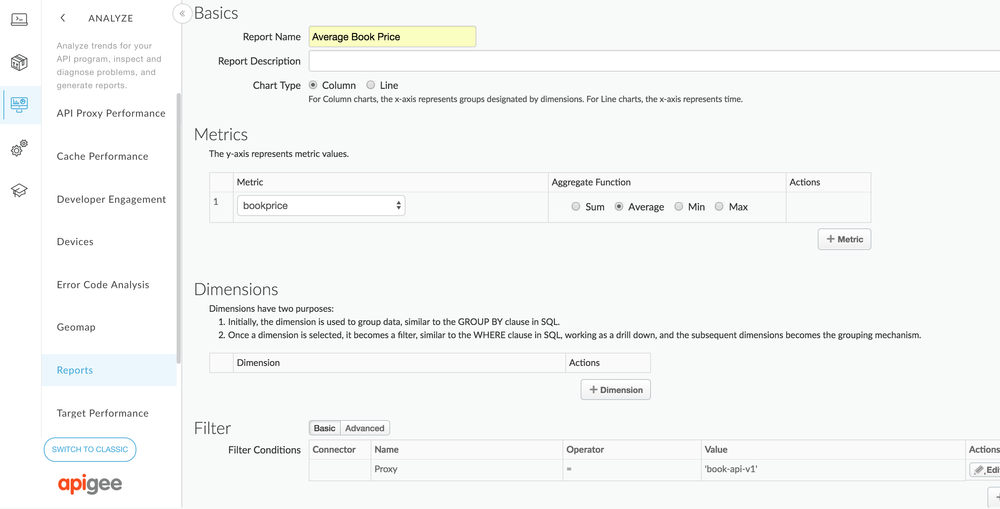

# Lab 2.01 - Custom Analytics

## Introduction

Objectives:

* Learn how to collect custom analytics in the API proxy implemented on the first day of the training.
* Generate custom reports based on the collected statistics.

## Instructions

We will take the solution available for lab 1.02 as starting point and follow the steps available below:

Whenever a new book is fetched using our API we would like to collect the book id and the book price so we can work out which the most sold book is and what is the average price that customers pay for a book.

1. Create a new Javascript policy that parses the JSON reponse payload and extracts as runtime variables the book id and the bookprice:

    * Policy

            <?xml version="1.0" encoding="UTF-8" standalone="yes"?>
            <Javascript async="false" continueOnError="false" enabled="true" timeLimit="200" name="Javascript.ParseBookResponse">
                <ResourceURL>jsc://parseBookResponse.js</ResourceURL>
            </Javascript>

    * Resource

            var payload = JSON.parse(context.getVariable('response.content'));
            context.setVariable('bookid', payload.id);
            context.setVariable('booktitle', payload.title);
            context.setVariable('bookprice', parseFloat(payload.price.replace(/[^\d.]/g, '')));

2. Create a new StatisticsCollector policy to collect the book id, title and price:

        <?xml version="1.0" encoding="UTF-8" standalone="yes"?>
        <StatisticsCollector async="false" continueOnError="false" enabled="true" name="StatisticsCollector.Book">
            <Statistics>
                <Statistic name="bookid" ref="bookid" type="string"/>
                <Statistic name="booktitle" ref="booktitle" type="string"/>
                <Statistic name="bookprice" ref="bookprice" type="float"/>
            </Statistics>
        </StatisticsCollector>

3. Add these two policies and steps to the &lt;Response&gt; element of the "Get Book by Id" conditional flow in the proxy endpoint.

        <Flow name="getBookById">
            <Response>
                <Step>
                    <Name>Javascript.ParseBookResponse</Name>
                </Step>
                <Step>
                    <Name>StatisticsCollector.Book</Name>
                </Step>
            </Response>
            <Condition>request.verb = "GET" AND proxy.pathsuffix MatchesPath "/books/*"</Condition>
        </Flow>

4. Create a custom report that shows us the average book price over a time period. Go to **Analytics > Reports** section and click on **+Custom Report**.

    

5. Enter the report name, select boolprice as metric and Average as the aggregation function. Make sure you also add a filter with the proxy name equal to book-api-v1

    

5. Get the average book price in the last day using the management API. Make sure you update the timeRange values in the query provided below 

        curl -v -u APIGEE-USER:APIGEE-PASSWORD "https://api.enterprise.apigee.com/v1/organizations/eslomibe-eval/environments/test/stats/?select=avg(bookprice)&timeRange=03/14/2018%2000:00~03/15/2018%2000:00&filter=(apiproxy%20eq%20%27book-api-v1%27)"